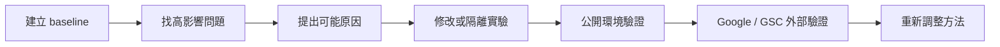
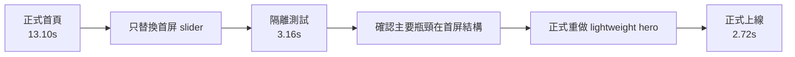

# B2B 工業網站 SEO × AIO 優化案例

> 真實、去識別化的 B2B 工業網站專案。目標是把 SEO 與 AIO 基礎做起來，讓搜尋引擎、AI 系統與潛在客戶更容易理解網站與產品資訊。

## 專案目標

我把問題拆成兩個方向：

1. **SEO**：改善效能、技術結構、三語頁面、索引與舊網址問題，讓 Google 更容易正確抓取、理解與導向內容。
2. **AIO**：整理頁面語意、產品資料與機器可讀資訊，降低搜尋引擎與 AI 對「這頁是什麼、產品是什麼、哪份資料才是真的」的猜測空間。

AI Agent 是方法之一，不是專案主角。

## 代表結果

| 結果 | 前期 / 修改前 | 後期 / 修改後 |
|---|---:|---:|
| Mobile LCP | 13.10s | **2.72s** |
| Lighthouse Mobile Performance | 約 73 | **96** |
| GSC 日均曝光 | 約 272.9 / 日 | **約 417.3 / 日** |
| GSC 日均點擊 | 約 5.1 / 日 | **約 6.7 / 日** |
| AI 摘要日均曝光 | 約 75.1 / 日 | **約 110.3 / 日** |

GSC 後期區間比前期短，因此另外用日均值做粗略標準化。這些搜尋數據屬於**修改後觀察到的外部趨勢**，不是 controlled experiment，不能把成長直接歸因到單一 SEO 或 AIO 修改。

→ [完整結果與限制](docs/results.md)

## 我的角色

我負責把業主資料、公開網站、Google 資料與 AI Agent 的輸出串成一個可執行的工作流程，主要工作包括：

- 找出優先問題並定義成功條件
- 判斷產品資料的權威來源
- 設計隔離測試與驗證方法
- 接受、拒絕或要求重新驗證 Agent 建議
- 決定修改是否能正式上線
- 用 Lighthouse、GSC、Rich Results 與公開頁結果檢查修改後狀態

## 材料與方法

資料來源包含 WordPress 公開頁面、三語內容、產品工程規格、HTML / PDF / images、Google Search Console、Google Rich Results Test、Lighthouse、公開匿名頁面與工作 logs。



→ [材料與方法](docs/methods.md)

## 問題 1：手機首頁約 13 秒

首頁使用 Smart Slider 3。最初可能原因包含 hosting、圖片、WordPress、JavaScript / CSS、cache 與 slider 本身。

我沒有直接改正式首頁，而是建立隔離測試頁，只替換第一屏 Smart Slider 3，其餘內容盡量保持可比較。



這份測試改變了決策方向。主要問題不是主機，而是第一屏的載入與渲染結構。正式頁保留背景、Logo、文字、CTA 與 responsive layout，但移除重型 slider runtime。

→ [首頁效能案例](performance/isolated-first-screen-test.md)

## 問題 2：有三語 URL，不代表三語內容真的完成

早期驗收已檢查 URL、H1、hreflang、schema 與部分 visual case，但後來發現只有繁中存在完整 pillar content，英文與簡中沒有等價 rendered DOM。

問題不是「少翻一頁」，而是**驗收指標把頁面存在誤當成內容等價**。

解法改成逐語言檢查 anonymous rendered DOM、H1、導航、產品連結、FAQ、CTA 與 desktop/mobile overflow，並在 cache purge 後重新驗證。

→ [三語內容漏同步](incidents/multilingual-false-pass.md)

## 問題 3：產品正文更新了，FAQ / JSON-LD 還是舊資料

產品工程規格更新後，visible main content 已是新值，但較早建立的 FAQ / JSON-LD 還保留舊值。

這代表同一個產品事實同時存在多個版本：正文、FAQ、structured data、knowledge JSON 與三語頁面。只改一處，其他衍生資料不會自動更新。

解法是建立 owner-confirmed truth source，並將衍生內容一起納入 consistency verification。

→ [產品資料一致性](incidents/product-truth-drift.md)

## 問題 4：網站自己看起來正常，不代表 Google 看到的舊網址也正常

GSC Page Indexing 顯示 32 個 redirected URLs。分類後，大部分屬於合理歷史行為，但其中 **14 個 legacy paths** 明明有清楚的新頁面，卻錯誤導向語言首頁。

我把 GSC 從成果報表改成外部驗證資料，對 14 個有明確對應頁的舊網址建立 relevant single-hop redirects。

→ [GSC 舊網址修正](search/search-console-redirect-review.md)

## 問題 5：Structured Data 不是加越多越好

專案曾嘗試 Product / ProductModel，但 Google Rich Results 的實際驗證與這個 B2B quote-only 網站的公開資料條件不相容。網站沒有 verified Offer、price、inventory、review、rating。

我的處理方式不是補假資料，而是移除不適合正式環境的 Product / ProductModel rich-result implementation，保留能由公開頁支持的 Article、Breadcrumb、Organization 與 visible product content。

AIO 在這裡的原則很簡單：**讓機器少猜，但不能讓機器讀到人類頁面上不存在的事實。**

→ [AIO 與 Structured Data](docs/aio-governance.md)

## 全站技術驗收

代表性的 release evidence：

- **122 / 122** sitemap URLs 通過公開檢查
- **116 / 116** desktop/mobile 三語視覺案例通過
- **170** 個站內連結無錯誤
- **92** 張圖片無 broken resource
- **14** 個錯誤 legacy redirects 已修正

這些結果代表上線完整度與技術準備度，不等於搜尋排名或 AI 引用的因果證明。

## 搜尋結果怎麼解讀

GSC 整體結果從前期到後期：

- 點擊：299 → 346
- 曝光：16,100 → 21,700
- CTR：1.9% → 1.6%
- 平均排名：6.3 → 8.8

曝光與點擊增加，但 CTR 與平均排名沒有同步改善。可能是原有搜尋詞排名下降，也可能是網站開始取得更多低順位的新搜尋詞曝光。只有總覽資料還無法判斷，需要進一步做搜尋詞與頁面層級分析。

AI 摘要曝光則從 4,428 → 5,736，日均約 +47.0%，但占整體 GSC 曝光比例大致持平，因此目前只能說 AI 摘要曝光隨整體搜尋可見度一起增加，不能宣稱 AIO 已提高 AI 摘要占比。

→ [結果與限制](docs/results.md)

## AI Agent 在這個專案中的位置

AI Agent 主要處理大量掃描、三語比較、HTML / script 候選版本、驗證腳本與 log 整理。人負責目標、資料真實性、實驗設計、是否上線與結果解讀。

專案中也發生過 Agent 判斷錯誤，例如把單一語言成功外推成三語完成，或正文已更新但 FAQ / JSON-LD 留下舊資料。這些錯誤後來被轉成新的驗證規則。

→ [Human-AI workflow](docs/human-ai-workflow.md)  
→ [代表性問題紀錄](docs/incidents.md)

## 限制與下一步

目前不能過度解讀的地方包括：

- GSC 前後期不是 controlled experiment，同期有多項修改
- CTR 與平均排名需要搜尋詞 / 頁面層級資料才能解釋
- AI 摘要曝光增加不代表 AIO 修改已被證明具有因果效果
- 單一產品 AIO experiment 仍是未執行假設
- 搜尋引擎索引、排名與 AI 摘要都有時間延遲

下一輪重點不是再增加 checklist，而是拆 GSC 的搜尋詞與頁面資料，判斷新增曝光來自品牌詞、產品詞、技術長尾詞，還是新三語頁面。

## 技術棧

`WordPress · Rank Math · Polylang · Breeze · Smart Slider 3 · Google Search Console · Google Rich Results Test · Schema.org / JSON-LD · Python · Node.js · Playwright · Lighthouse · GitHub · Google Drive · AI Agents`

## Repository map

```text
.
├── README.md
├── TODO.md
├── docs/
│   ├── methods.md
│   ├── results.md
│   ├── aio-governance.md
│   ├── human-ai-workflow.md
│   └── incidents.md
├── performance/
│   └── isolated-first-screen-test.md
├── incidents/
│   ├── multilingual-false-pass.md
│   └── product-truth-drift.md
├── search/
│   └── search-console-redirect-review.md
├── experiments/
├── hypotheses/
├── examples/
├── logs/
└── scripts/
```

公開版本已移除或泛化客戶身分、私人商業內容、credentials、內部路徑、未公開工程資訊與可識別的原始工作資料。
