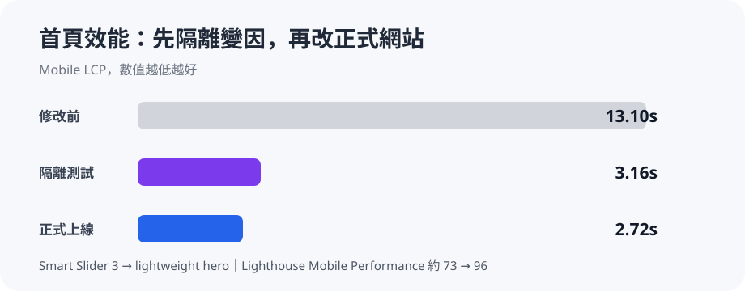
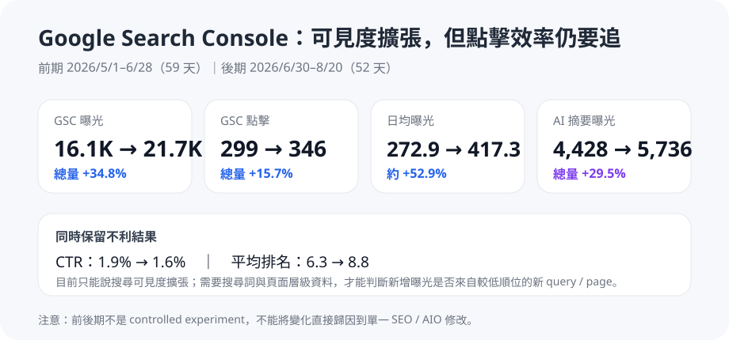
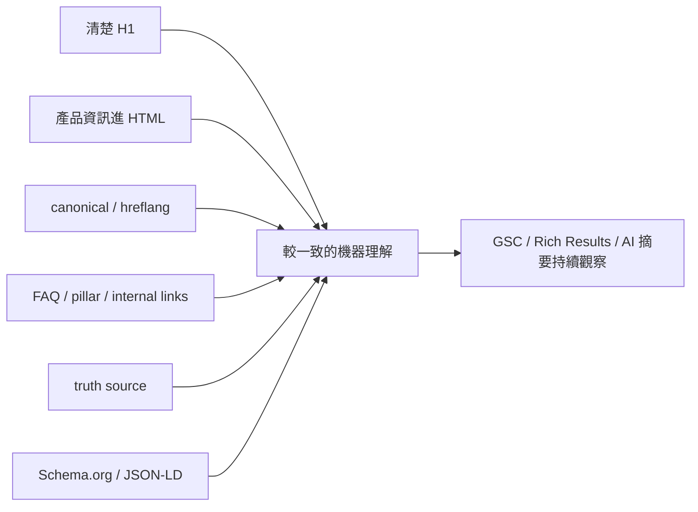

# B2B 工業網站 SEO × AIO 優化案例

> 真實、去識別化的 B2B 工業網站專案。目標是把 SEO 與 AIO 基礎做起來，讓搜尋引擎、AI 系統與潛在客戶更容易理解網站與產品資訊。

**我的角色**：找出高影響問題、定義驗收方式、判斷產品資料來源、設計隔離測試，並決定 AI Agent 的建議是否能進正式網站。

**技術棧**：`WordPress · Rank Math · Polylang · Breeze · Smart Slider 3 · Google Search Console · Google Rich Results Test · Schema.org / JSON-LD · Python · Node.js · Playwright · Lighthouse · GitHub · Google Drive · AI Agents`

## 代表結果

| 指標 | 前期 / 修改前 | 後期 / 修改後 |
|---|---:|---:|
| Mobile LCP | 13.10s | **2.72s** |
| Lighthouse Mobile Performance | 約 73 | **96** |
| GSC 日均曝光 | 約 272.9 / 日 | **約 417.3 / 日** |
| GSC 日均點擊 | 約 5.1 / 日 | **約 6.7 / 日** |
| AI 摘要日均曝光 | 約 75.1 / 日 | **約 110.3 / 日** |





GSC 前後期不是 controlled experiment，因此搜尋成長只能視為**修改後觀察到的外部趨勢**，不能直接歸因到某一個 SEO / AIO 動作。CTR 也從 1.9% 降到 1.6%，平均排名從 6.3 變成 8.8，這些不利結果同樣保留分析。

→ [完整結果與限制](docs/results.md)

## 材料與方法

資料來源包含 WordPress 公開頁面、三語內容、產品工程規格、HTML / PDF / images、Google Search Console、Google Rich Results Test、Lighthouse、anonymous public output 與工作 logs。


→ [材料與方法](docs/methods.md)

## 我遇到的 5 個主要問題

### 1. 手機首頁約 13 秒

首頁使用 Smart Slider 3。我先建立隔離測試頁，只替換第一屏 slider，其餘內容盡量保持可比較。Mobile LCP 從 **13.10s → 3.16s**，因此修改方向從「可能換 hosting」轉成「先重做首屏結構」。正式上線後約 **2.72s**。

→ [完整案例](performance/isolated-first-screen-test.md)

### 2. 有三語 URL，不代表三語內容真的完成

早期驗收已通過 URL、H1、hreflang 等項目，但後來發現只有繁中存在完整 pillar content。問題在於原本的 validation metric 把「page exists」當成「content equivalent」。後續改成逐語言檢查 anonymous rendered DOM、FAQ、CTA、links 與 desktop/mobile output。

→ [完整案例](incidents/multilingual-false-pass.md)

### 3. 產品正文更新了，FAQ / JSON-LD 還是舊資料

產品工程規格更新後，正文已是新值，但較早建立的 FAQ / JSON-LD 仍保留舊值。解法是建立 owner-confirmed truth source，並將正文、FAQ、structured data、knowledge JSON 與三語頁一起做 consistency verification。

→ [完整案例](incidents/product-truth-drift.md)

### 4. 本地 QA 正常，不代表 Google 看到的舊網址也正常

GSC Page Indexing 顯示 32 個 redirected URLs，其中 **14 個 legacy paths** 有明確新頁面，卻錯誤導向語言首頁。後續改成 relevant single-hop redirects，也把 GSC 從成果 dashboard 變成外部驗證資料。

→ [完整案例](search/search-console-redirect-review.md)

### 5. Structured Data 不是加越多越好

專案曾嘗試 Product / ProductModel，但公開頁沒有 verified Offer、price、inventory、review、rating。我的決策是不補假資料，而是移除不適合正式環境的 Product / ProductModel rich-result implementation，保留能由公開內容支持的 Article、Breadcrumb、Organization 與 visible product content。

→ [AIO 與 Structured Data](docs/aio-governance.md)

## AIO 在這個專案裡是什麼

我把 AIO 定義成：**降低搜尋引擎與 AI 對網站內容的猜測空間。**



目前 AI 摘要曝光從 4,428 → 5,736，日均約 +47.0%，但占整體 GSC 曝光比例大致持平，所以只能說**AI 摘要曝光隨整體搜尋可見度一起增加**，不能宣稱某個 Schema、FAQ 或 H1 修改造成這個結果。

## AI Agent 在哪裡

AI Agent 用來做大量掃描、三語比較、HTML / script 候選版本、驗證腳本與 log 整理；人負責目標、資料真實性、實驗設計、是否上線與結果解讀。

Agent 也曾犯錯，例如把單一語言成功外推成三語完成，或正文更新後留下 stale FAQ / JSON-LD。這些錯誤後來被轉成新的 validation rules，而不是從專案歷史裡刪掉。

→ [Human-AI workflow](docs/human-ai-workflow.md)  
→ [代表性問題紀錄](docs/incidents.md)

## 全站技術驗收

- **122 / 122** sitemap URLs 通過公開檢查
- **116 / 116** desktop/mobile 三語視覺案例通過
- **170** 個站內連結無錯誤
- **92** 張圖片無 broken resource
- **14** 個錯誤 legacy redirects 已修正

這些數字代表上線完整度與技術準備度，不等於搜尋排名或 AI 引用的因果證明。

## 限制與下一步

下一輪最值得做的不是再增加 checklist，而是取得 GSC 搜尋詞與頁面層級資料，回答：新增曝光來自品牌詞、產品詞、技術長尾詞，還是新三語頁面？原有高排名搜尋詞是否真的下降？AI 摘要曝光又集中在哪些搜尋詞與頁面？

另外，「挑一個產品作 AIO experiment group」目前仍是未執行假設，不列入成果。

→ [完整結果與限制](docs/results.md)  
→ [未執行的 AIO 實驗假設](hypotheses/single-product-aio-experiment.md)

## Repository map

```text
.
├── README.md
├── TODO.md
├── assets/
├── docs/
│   ├── methods.md
│   ├── results.md
│   ├── aio-governance.md
│   ├── human-ai-workflow.md
│   └── incidents.md
├── performance/
├── incidents/
├── search/
├── experiments/
├── hypotheses/
├── examples/
├── logs/
└── scripts/
```

公開版本已移除或泛化客戶身分、私人商業內容、credentials、內部路徑、未公開工程資訊與可識別的原始工作資料。
